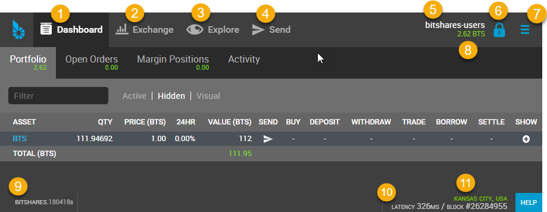
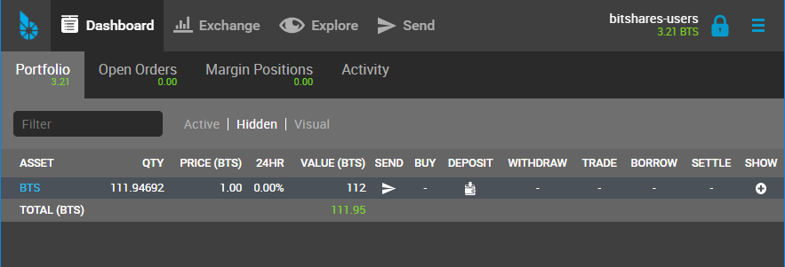

*****************************
BitShares Wallet Features
*****************************

.. contents:: Table of Contents

------

|

Quick Review Wallet Options
============================

+----+--------------------------+---------------------------------------------------------------------------------------------------------------+
|    | Item name                |  note                                                                                                         |
+====+==========================+===============================================================================================================+		
| 1  | Dashboard                | The Wallet Portfolio, Open Orders, Margin Positions, and Activity information                                 |
+----+--------------------------+---------------------------------------------------------------------------------------------------------------+
| 2  | Exchange                 | BitShares Exchange, Trading information                                                                       |
+----+--------------------------+---------------------------------------------------------------------------------------------------------------+ 
| 3  | Explore                  | BitShares Live Blockchain, Assets, Accounts, Witnesses members, Committee members, Markets, and Fee Schedule  |
+----+--------------------------+---------------------------------------------------------------------------------------------------------------+
| 4  | Send                     | Opens a Send form. You can send funds to other BitShares Account Holders                                      |
+----+--------------------------+---------------------------------------------------------------------------------------------------------------+
| 5  | A BitShares account name | A account name that the data shows on a Dashboard page                                                        |
+----+--------------------------+---------------------------------------------------------------------------------------------------------------+
| 6  | Key icon                 | By click, opens a login form. Locked/Unlocked Key icon shows if you've logged in the account currently        |
+----+--------------------------+---------------------------------------------------------------------------------------------------------------+
| 7  | Side Menu icon           | Side Menu icon opens the wallet other menus in a dropdown list                                                |
+----+--------------------------+---------------------------------------------------------------------------------------------------------------+
| 8  | Asset Total              | Currently showing in a Dashboard Total Assets                                                                 |
+----+--------------------------+---------------------------------------------------------------------------------------------------------------+
| 9  | BitShares Wallet Version | The Release Version of BitShares UI Wallet                                                                    |
+----+--------------------------+---------------------------------------------------------------------------------------------------------------+
| 10 | Latency                  | The delay of Network connection                                                                               |
+----+--------------------------+---------------------------------------------------------------------------------------------------------------+
| 11 | Server Node name         | A server node name that you are connecting                                                                    |
+----+--------------------------+---------------------------------------------------------------------------------------------------------------+

|

Dashboard
----------------

		
		
**Dashboard Tabs**

+------------------+-------------------------------------------------------------------------------------------------+
|   Tab name       |  note                                                                                           |
+==================+=================================================================================================+
| Portfolio        | Your Assets list. You can filter the assets and hide some assets if you don't need to watch.    |
+------------------+-------------------------------------------------------------------------------------------------+
| Open Orders      |                                                                                                 |
+------------------+-------------------------------------------------------------------------------------------------+
| Margin Positions |                                                                                                 |
+------------------+-------------------------------------------------------------------------------------------------+
| Activity         | Show your all transactions. (i.e., The below shows a type of transactions to choose from.)      |
+------------------+-------------------------------------------------------------------------------------------------+

**Activity - Filters**

.. image:: ../images/dashboard-activity2.png
        :alt: Dashboard 
        :width: 450px
        :align: center	
		
|

Side Menus - Dropdown items
-------------------------------

+------------------+-------------------------------------------------------------------------------------------------+
|   option         |                                                                                                 |
+==================+=================================================================================================+
| login            | By click, opens a login form.                                                                   |
+------------------+-------------------------------------------------------------------------------------------------+
| Create Account   | Users who have a lifetime membership (LTM) can register multiple accounts in parallel;          |
+                  +-------------------------------------------------------------------------------------------------+
|                  | all of them are stored in a single wallet                                                       |
+------------------+-------------------------------------------------------------------------------------------------+
| Send(legacy)     | Transfer details (Original page). **Send** on the top menu is new form.                         |
+------------------+-------------------------------------------------------------------------------------------------+
| Deposit          | Deposit funds from other parties (Original Deposit page)                                        |
+------------------+-------------------------------------------------------------------------------------------------+
| Deposit(beta)    | Select an asset you want to deposit and provide you a sending address, Gateway,                 |
|                  | identicon, and notes.                                                                           |
+------------------+-------------------------------------------------------------------------------------------------+
| Withdraw         |  (Original Withdraw page)                                                                       |
+------------------+-------------------------------------------------------------------------------------------------+
| Withdraw(beta)   | Search an asset to withdraw                                                                     |
+------------------+-------------------------------------------------------------------------------------------------+
| Settings         | You can manage your wallet appearance  and other settings.                                      |
+                  +-------------------------------------------------------------------------------------------------+
+                  + Settings - CLOUD Wallet Login Mode:                                                             +
+                  +-------------------------------------------------------------------------------------------------+
|                  | - General                                                                                       |
|                  | - Accounts                                                                                      |
|                  | - Restore/Import                                                                                |
|                  | - Nodes                                                                                         |
|                  | - Faucet                                                                                        |
|                  | - Reset settings                                                                                |
+                  +-------------------------------------------------------------------------------------------------+
|                  | Settings - LOCAL Wallet Login Mode:                                                             |
+                  +-------------------------------------------------------------------------------------------------+
|                  | - General                                                                                       |
|                  | - Local Wallet                                                                                  |
|                  | - Accounts                                                                                      |
|                  | - Password                                                                                      |
|                  | - Backup                                                                                        |
|                  | - Restore/Import                                                                                |
|                  | - Access                                                                                        |
|                  | - Faucet                                                                                        |
+------------------+-------------------------------------------------------------------------------------------------+
| News             | BitShares Blockchain Foundation and other News                                                  |
+------------------+-------------------------------------------------------------------------------------------------+
| Help             | Open a Help page                                                                                |
+------------------+-------------------------------------------------------------------------------------------------+
| Voting           | You can vote for Witnesses, Committee or Workers. Or you can set a Proxy to case a vote.        |
+                  +-------------------------------------------------------------------------------------------------+
|                  | Voting is important: in Bitshares in the same way it is important to the community              |
|                  | in which you live. The weight of your vote is directly correlated to the number of BTS you own. |
+                  +-------------------------------------------------------------------------------------------------+
|                  | If you aren't heavily involved in the community, you are encouraged to choose a proxy who       |
|                  | represents your interests.                                                                      |
+------------------+-------------------------------------------------------------------------------------------------+
| Asset            |  Issued Assets                                                                                  |
+------------------+-------------------------------------------------------------------------------------------------+
| Signed Message   |                                                                                                 |
+------------------+-------------------------------------------------------------------------------------------------+
| Membership stats | Basic Member is a default membership. You can upgrade to Lifetime Membership here.              |
+------------------+-------------------------------------------------------------------------------------------------+
| Vesting balances | Vesting balances contain any fees earned through the referral program or from worker pay,       |
+                  +-------------------------------------------------------------------------------------------------+
|                  | For example. They have a tain vesting period and are continually unlocked during                |
|                  | that vesting period until all of the balances are available                                     |
+------------------+-------------------------------------------------------------------------------------------------+
| Whitelist        | You can set Whitelist and/or Blicklist. Also, you can view 'Whitelisted by' and                 |
|                  | 'Blacklisted by'.                                                                               |
+------------------+-------------------------------------------------------------------------------------------------+
| Permissions      | You can review/renew each account’s (Active, Owner, and Memo) Public keys                       |  
|                  | and Private keys information.                                                                   |
+                  +-------------------------------------------------------------------------------------------------+
|                  | Active Permission: It’s consider to be the “online” permission. control accessing funds         |
|                  | and some account settings.                                                                      |
+                  +-------------------------------------------------------------------------------------------------+
|                  | Owner Permission: This permission has administrative power over the account                     |
|                  | Also, if you want to change your Cloud Wallet password, use the “Cloud Wallet” tab page.        |
+------------------+-------------------------------------------------------------------------------------------------+
| (Accounts)       |                                                                                                 |
+------------------+-------------------------------------------------------------------------------------------------+

|

|

|